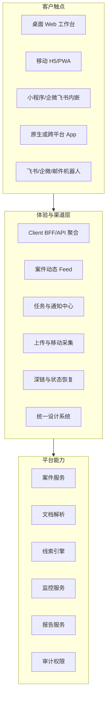

# 客户体验与多端交付评估

生成日期：2026-06-14

## 1. 核心结论

这个平台最终不是交付给技术团队使用，而是交付给律师使用。律师不会关心 OCR、RAG、向量库、模型网关或插件机制，他们只会关心：

```text
我能不能更快知道案件下一步该做什么？
这个线索靠不靠谱？
来源在哪里？
我能不能少整理材料、少漏信息、少返工？
手机上能不能及时收到并处理重要提醒？
```

因此后续施工必须把“客户体验层”和“多端交付层”前置为 P0 架构约束，而不是等平台能力做完后再补 UI。

推荐交付策略：

```text
P0：响应式 Web 工作台 + 企业微信/飞书/邮件通知 + 移动 H5 深链
P1：按客户生态选择小程序或企业微信/飞书内嵌 H5
P2：只有在高频移动作业、离线、安全管控或拍照扫描强需求成立后，再做原生 App 或跨平台 App
```

## 2. 顶级技能路由结论

| 视角 | 结论 |
|---|---|
| 产品战略 | 主责。先定义律师客户旅程、满意度指标、交付形态和非目标 |
| 平台架构 | 从责。平台必须增加体验层、渠道适配层和 BFF/API 聚合层 |
| 前端/UX | 从责。界面要工作台化、低认知、移动优先、可复核 |
| 移动开发 | 从责。APP/小程序/Web 不是同一件事，必须按任务频率和生态选择 |
| QA | 从责。验收必须加入可用性测试、移动端适配、通知闭环和性能门禁 |

暂不触发纯代码实现技能，因为本轮是产品和交付架构评估，不是开发某个端。

## 3. 客户画像修正

### 3.1 律师是客户，不是技术使用者

律师使用系统时，不会按模块理解平台，而会按问题理解平台：

| 律师语言 | 不应展示成 | 应展示成 |
|---|---|---|
| 这个案子现在有什么新情况？ | 监控调度、语义 Diff | 今日新增风险/线索 |
| 被执行人还有什么可查？ | 数据连接器、主体图谱 | 可执行财产线索 |
| 这个结论靠不靠谱？ | RAG、embedding、模型置信度 | 来源、页码、数据时间、复核状态 |
| 我下一步该干什么？ | Agent workflow | 建议动作、待核验事项、可转任务 |
| 这个材料整理好了吗？ | OCR pipeline | 可阅读文档、低置信度待校对 |

### 3.2 关键角色

| 角色 | 设备习惯 | 核心体验诉求 |
|---|---|---|
| 律所负责人 | 手机看提醒，电脑看汇总 | 一眼知道案件风险、线索价值和团队进度 |
| 承办律师 | 电脑深度处理，手机快速确认 | 快速拿到可靠报告，能追溯，能分派任务 |
| 律师助理 | 电脑批量上传整理，手机接收任务 | 少录入、少查重、少重复整理 |
| IT/管理员 | 电脑配置 | 权限、数据源、审计、模型策略可控 |
| 客户或外部协作方 | 可能不直接使用 | 如需开放，只能看到受控报告或材料清单 |

## 4. 律师体验北极星

### 4.1 北极星体验

```text
打开一个案件，30 秒内看到最重要的线索、风险、来源和下一步动作。
```

这比“功能很多”更重要。

### 4.2 核心满意度指标

| 指标 | 目标 |
|---|---|
| 首次价值时间 | 新案件上传后，10 分钟内看到第一版可读材料或要素摘要 |
| 线索理解时间 | 律师打开线索报告后，30 秒内能判断哪些值得核验 |
| 报告可信度 | 100% 关键结论可点回来源、页码或外部数据记录 |
| 移动处理效率 | 手机端 3 步内完成“查看提醒、确认/忽略、转任务” |
| 学习成本 | 新律师无需培训超过 30 分钟即可完成 P0 主流程 |
| 噪声控制 | 无效提醒率持续下降，律师可标记“不重要/重复/已处理” |
| 复核闭环 | 每个 AI 输出都有“待复核、已确认、已修改、已驳回”状态 |

## 5. 交付形态评估

### 5.1 形态矩阵

| 形态 | 适合场景 | 优点 | 风险 | 建议阶段 |
|---|---|---|---|---|
| 桌面 Web | 文档处理、报告复核、监控配置、权限审计 | 开发快、能力完整、适合重工作流 | 移动体验若不设计会差 | P0 必做 |
| 响应式 H5/PWA | 手机查看提醒、轻量复核、移动深链 | 一套 Web 可复用，交付快 | 离线和系统级推送有限 | P0 必做移动适配 |
| 企业微信/飞书内嵌 H5 | 律师日常办公入口、提醒处理 | 无需安装，组织内推广快 | 受平台容器限制 | P0/P1 推荐 |
| 微信小程序 | 外部客户或微信生态强依赖团队 | 易触达，用户熟悉 | 上传大文件、复杂文档校对受限 | P1 视客户生态决定 |
| 原生 App | 高频移动作业、离线、安全策略、拍照扫描 | 体验最好，系统能力强 | 成本高，迭代慢，安装门槛 | P2 再决策 |
| React Native/Flutter | 需要类原生体验但团队想复用 | 统一多端开发 | 原生集成和稳定性仍需投入 | P2 候选 |

### 5.2 推荐选择

P0 不建议先做原生 App。原因：

- 第一阶段核心工作是文档处理、线索报告、复核和监控配置，桌面 Web 更适合。
- 律师手机端最需要的是提醒、查看、确认、转任务，不需要完整重工作台。
- 原生 App 会拖慢试点速度，并迫使团队过早处理应用商店、版本审核、推送证书、设备兼容。
- 响应式 Web + 通知机器人 + 移动 H5 深链可以更快验证真实使用频率。

推荐路径：

```text
P0：桌面 Web 工作台为主，移动 H5 做轻操作，飞书/企微/邮件做提醒。
P1：如果客户强微信生态，做小程序；如果组织在企微/飞书，优先内嵌 H5。
P2：当移动端日活、拍照上传、离线查阅、系统级安全策略都被验证后，再做 App。
```

## 6. 体验层架构补充

原平台蓝图需要新增一层：Client Experience Layer。



### 6.1 为什么需要 BFF

不同端看到的不是同一套信息密度：

- 桌面 Web 需要完整材料、表格、报告、校对、配置。
- 手机端需要摘要、重点线索、状态、按钮。
- 小程序需要轻量数据、低输入、短流程。
- 通知机器人需要一句话摘要、操作按钮和深链。

如果所有端直接调业务 API，后续会出现重复拼装、体验不一致和权限漏洞。应增加 Client BFF/API 聚合层，负责：

- 按端裁剪字段和信息密度。
- 聚合案件摘要、线索、任务、提醒。
- 统一深链、权限校验、审计埋点。
- 支持灰度不同端体验。

## 7. 信息架构建议

### 7.1 桌面 Web

主导航不应按技术模块命名，而应按律师工作流命名：

```text
首页
案件
材料
线索
监控
任务
报告
知识库
设置
```

案件详情页建议结构：

```text
案件概览
  - 今日重点
  - 关键期限
  - 最新线索
  - 待复核事项
  - 风险提示

材料
  - 原文件
  - 解析文本
  - 低置信度校对
  - 要素抽取

线索
  - 可执行线索排序
  - 来源与证据
  - 建议动作
  - 核验状态

监控
  - 监控主体
  - 新增事件
  - 推送记录

报告
  - 财产线索报告
  - 案件要素摘要
  - 类案报告
  - 导出记录
```

### 7.2 手机端/H5/小程序

移动端只做高频轻操作：

```text
今日提醒
案件动态
线索详情
一键确认/忽略/转任务
拍照或上传材料
查看报告摘要
联系负责人/分派助理
```

不建议第一版在手机端做：

- 复杂 PDF 双栏校对。
- 复杂监控规则配置。
- 大篇幅类案检索调参。
- 权限和插件管理。
- 大型报告编辑。

## 8. 关键界面原则

### 8.1 展示律师关心的判断，不展示技术过程

错误方式：

```text
RAG 已完成，embedding 相似度 0.82，LLM 生成成功。
```

正确方式：

```text
发现 3 条高价值财产线索，其中 1 条建议优先核验。
来源：人民法院诉讼资产网，发现时间：2026-06-14 09:30。
建议动作：核验资产归属后提交执行法院。
```

### 8.2 所有结论都要三件套

```text
为什么重要
来源在哪里
下一步做什么
```

这三件套比模型解释更重要。

### 8.3 状态设计必须清楚

| 状态 | 含义 |
|---|---|
| 待解析 | 文件已上传，系统正在处理 |
| 待校对 | 有低置信度内容，需要人工确认 |
| 待复核 | AI/系统已生成结果，律师未确认 |
| 已确认 | 律师确认可用 |
| 已修改 | 律师修改过系统输出 |
| 已驳回 | 输出不可用，需记录原因 |
| 已转任务 | 线索或提醒已进入执行动作 |

### 8.4 移动端触控和性能

- 触控目标不小于 44px。
- 移动端关键流程不超过 3 步。
- 首屏优先显示骨架屏和核心摘要，长报告懒加载。
- 重要操作要有撤销或二次确认。
- 表格在移动端转为摘要卡片，不强行横向挤压。
- 网络弱时显示“已保存草稿/稍后同步”。

## 9. 客户验收场景

P0 必须用真实律师完成可用性验收，而不是只让内部技术人员验收。

### 9.1 5 个核心场景

1. 助理上传一份判决书 PDF，系统生成可读 Markdown，并标出待校对内容。
2. 承办律师输入被执行人，系统生成财产线索报告，并能点回来源。
3. 律师在手机上收到新增拍卖提醒，能 3 步内确认并转任务。
4. 负责人打开案件首页，30 秒内看懂最新线索、风险和待处理事项。
5. 律师驳回一条错误线索，系统记录原因并避免同类噪声重复推送。

### 9.2 验收门禁

| 门禁 | 标准 |
|---|---|
| 可用性 | 5 名律师中至少 4 名能无指导完成 P0 主流程 |
| 可理解性 | 律师能说清每条线索的来源、重要性和下一步动作 |
| 移动端 | 手机端能完成提醒查看、确认、忽略、转任务 |
| 性能 | 桌面首屏核心内容 3 秒内可用，移动端提醒详情 2 秒内可读 |
| 信任 | 关键结论 100% 可回溯来源 |
| 噪声 | 推送必须可反馈“不重要/重复/已处理” |

## 10. 对原施工蓝图的影响

### 10.1 新增 P0 工作包

| 工作包 | 说明 |
|---|---|
| 客户旅程地图 | 按负责人、承办律师、助理梳理真实使用链路 |
| 信息架构原型 | 桌面 Web 和手机 H5 的低保真原型 |
| 设计系统基础 | 状态、风险等级、线索卡片、来源引用、任务按钮 |
| Client BFF | 为多端聚合案件动态、线索摘要、任务和提醒 |
| 通知中心 | 推送、站内通知、移动深链、处理状态同步 |
| 可用性测试 | 3-5 名律师真实任务测试 |

### 10.2 调整后的 P0 优先级

原 P0：平台内核 + 文档解析 + 线索引擎 + 监控推送 + 审计。

调整后 P0：

```text
客户旅程与原型
  -> 平台内核
  -> 桌面 Web 工作台
  -> 文档解析
  -> 线索报告
  -> 通知中心 + 移动 H5 深链
  -> 监控推送
  -> 律师复核闭环
  -> 可用性验收
```

## 11. 新增 ADR 建议

### ADR-006：P0 采用 Web 工作台 + 移动 H5/通知入口，而不是原生 App 优先

决策：第一阶段不先做原生 App，优先响应式 Web、移动 H5、企业微信/飞书/邮件通知。

理由：执行案件试点的核心任务是重文档、重报告、重复核，桌面 Web 承载效率最高；移动端先满足提醒和轻操作即可。

复审触发：移动端日活超过 60%，拍照上传/离线查阅成为高频刚需，或客户明确要求设备级安全策略。

### ADR-007：增加 Client BFF/API 聚合层

决策：多端不直接拼业务 API，由 BFF 按端聚合案件动态、线索摘要、提醒和任务。

理由：律师端的信息密度和操作不同，BFF 能减少多端重复逻辑、保护权限、统一审计和深链。

复审触发：只有单一 Web 端且三个月内无移动端计划时，可暂缓完整 BFF，但仍需保留 API 聚合边界。

### ADR-008：体验验收与功能验收同级

决策：P0 上线门禁必须包含律师可用性测试。

理由：客户不感知技术完成度，只感知是否好用、可信、少返工。

复审触发：无。该决策长期有效。

## 12. 下一步建议

1. 在 Phase 0 增加 3-5 名律师访谈，记录他们一天中如何查线索、看材料、接提醒、分派任务。
2. 先画两个原型：桌面案件详情页、手机提醒详情页。
3. 把每个技术模块翻译成律师可理解的界面文案，禁止把 OCR、RAG、embedding 作为主界面语言。
4. 决定客户生态：飞书、企业微信、微信小程序、还是普通 Web 登录。
5. 把“可用性验收”写进 P0 合同或内部里程碑。