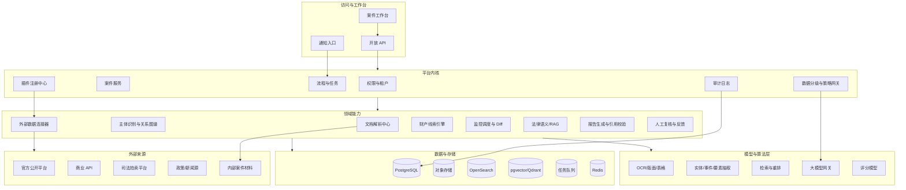

# 律师团队 AI 平台施工蓝图

生成日期：2026-06-14

## 1. 一句话结论

平台应建设为“法律案件数据操作系统”，第一阶段以执行案件为切入口，底座按插件化平台设计，让文档解析、数据源连接、主体识别、财产线索、动态监控、法律语义和审计权限都能独立迭代、组合复用。

这不是单点 OCR、爬虫集合或聊天助手，而是：

```text
案件工作台 + 文档管线 + 数据连接器 + 主体图谱 + 线索引擎 + 监控推送 + 法律语义内核 + 审计治理平台
```

## 2. 设计依据

本蓝图继承历史文档中的收敛判断：

- 第一阶段聚焦“执行案件财产线索与动态监控工作台”。
- 长期方向是“法律案件作战室 + 执行财产线索引擎 + 法律情报监控平台”。
- 规则、API、数据库处理确定性任务；AI 处理非结构化理解、归类、摘要、报告生成和语义辅助。
- 律师负责最终判断，所有高风险输出必须可追溯、可复核、可审计。
- 不承诺绕过验证码、登录限制、付费墙或平台风控；不承诺自动查询非公开房产、车辆、银行账户。

## 3. 关键假设与边界

### 3.1 假设

- 初期服务一个律师团队，后续可能扩展到多个团队或律所。
- 第一阶段能拿到 10 份以上真实 PDF 样本、5 个执行案件样本、2 到 3 个稳定数据源或商业 API 授权。
- 敏感案件材料优先使用国内合规云模型、私有化模型或本地处理。
- 团队愿意保留人工复核环节，并把复核反馈作为系统迭代数据。

### 3.2 明确不做

- 不做全能法律 AI。
- 不做无来源、无引用、无审计的法律意见生成。
- 不用未授权爬虫抓取商业平台数据。
- 不绕过验证码、登录、风控、付费墙。
- 不让模型直接执行外发、删除、提交法院材料等高风险动作。
- 第一阶段不追求知识图谱、蒸馏、经营看板、获客情报全部落地。

## 4. 产品目标

### 4.1 目标用户

| 用户 | 核心目标 | 平台要解决的问题 |
|---|---|---|
| 律所负责人 | 提高案件效率、降低人工成本、沉淀团队经验 | 看到案件进度、线索质量、风险和投入产出 |
| 执行案件律师 | 找到可执行财产和行动建议 | 快速获得可复核的财产线索报告 |
| 律师助理 | 整理材料、检索信息、跟踪动态 | 降低 PDF/OCR、查询、摘录和监控工作量 |
| IT/交付负责人 | 稳定、安全、可维护地接入模型和数据源 | 控制数据源、权限、审计、模型替换和插件迭代 |
| 法律业务专家 | 定义线索价值、复核报告、沉淀规则 | 把经验变成规则、模板、评分和评估集 |

### 4.2 成功指标

| 指标类型 | 第一阶段目标 |
|---|---|
| 材料处理 | 文档整理时间下降 50%-80%，低置信度内容可人工校对 |
| 线索报告 | 初步财产线索报告从半天/一天缩短到几十分钟 |
| 可追溯性 | 100% 线索包含来源、时间、置信度、建议动作 |
| 监控提醒 | 重点主体由人工定期检查变为系统自动提醒 |
| 合规审计 | 上传、查询、模型调用、报告输出、复核全链路留痕 |
| 业务闭环 | 律师能对线索标记“有用、无用、待核验、已行动” |

## 5. 能力地图

```text
P0 第一阶段：执行案件试点
  - 案件工作台
  - 文档中心与 PDF 解析
  - 案件要素抽取
  - 被执行人主体识别
  - 数据源连接器 MVP
  - 财产线索报告
  - 重点主体监控
  - 飞书/企微/邮件/站内通知
  - 权限与审计基础
  - 人工复核闭环

P1 第二阶段：办案辅助增强
  - 类案检索与裁判倾向
  - 证据矩阵
  - 文书初稿与质检
  - 庭审笔录摘要
  - 线索评分迭代
  - 数据源连接器扩展
  - 质量评估集与质量看板

P2 第三阶段：经营与知识沉淀
  - 业务开拓情报
  - 行业政策监控
  - 客户合规提示
  - 私有知识图谱
  - 律师反馈蒸馏
  - 团队经营看板
  - 多团队/多律所产品化治理
```

## 6. 总体架构



## 7. 分层设计

### 7.1 访问层

- 案件工作台：案件首页、文档、线索、监控、任务、报告、复核记录。
- 文档预览与校对：原 PDF 与 Markdown/JSON 双栏对照，低置信度高亮。
- 报告中心：财产线索报告、案件要素摘要、类案报告、证据矩阵。
- 通知入口：飞书、企业微信、邮件、站内通知。
- 内部 API：为自动化流程、批量导入和后续第三方集成保留接口。

### 7.2 平台内核层

| 模块 | 职责 |
|---|---|
| 租户与权限 | 多团队隔离、角色权限、数据分级访问控制 |
| 案件服务 | 案件、当事人、材料、任务、状态、负责人 |
| 插件注册中心 | 数据连接器、解析器、模型供应商、报告模板、通知渠道的注册与版本管理 |
| 流程引擎 | 文档解析、线索生成、监控任务、复核流程、报告发布 |
| 策略网关 | 根据数据等级、用户权限、模型策略决定是否允许处理、脱敏或外发 |
| 审计日志 | 记录上传、查询、模型调用、报告输出、复核、导出 |

### 7.3 领域能力层

| 领域服务 | P0 职责 | P1/P2 演进 |
|---|---|---|
| 文档解析中心 | PDF/OCR/Markdown/JSON/坐标映射/置信度 | 证据分类、自动命名、表格增强、批量归档 |
| 主体识别服务 | 企业/自然人消歧、曾用名、统一社会信用代码匹配 | 多层股权、实际控制人、关系强度评分 |
| 数据连接器服务 | 2 到 3 个授权数据源接入、结果规范化 | 连接器市场、字段血缘、数据质量评分 |
| 财产线索引擎 | 股权、拍卖、执行、关联主体、知识产权等线索抽取与评分 | 线索价值模型迭代、行动建议优化 |
| 监控调度服务 | 指定主体定时查询、快照、字段 Diff、事件推送 | 语义 Diff、策略订阅、监控范围扩展 |
| 法律语义服务 | 案件要素抽取、引用校验、受控报告生成 | 类案检索、证据矩阵、文书初稿、裁判倾向 |
| 人工复核服务 | 律师确认、驳回、修改、标记线索价值 | 反馈蒸馏、评估集、质量看板 |

## 8. 插拔式架构

### 8.1 插件类型

| 插件类型 | 作用 | 示例 |
|---|---|---|
| DataConnector | 接入外部公开平台或商业 API | 企查查、天眼查、执行公开网、司法拍卖 |
| DocumentParser | 文档解析能力 | PaddleOCR、Docling、MinerU、Marker |
| Extractor | 结构化抽取 | 案件要素、金额、期限、主体、证据类型 |
| Scorer | 评分模型 | 线索可执行性、价值规模、新鲜度、可信度 |
| ModelProvider | 模型供应商 | 国内合规云、私有化模型、脱敏后高能力模型 |
| ReportTemplate | 报告模板 | 财产线索报告、类案报告、证据矩阵 |
| Notifier | 推送渠道 | 飞书、企业微信、邮件、站内通知 |
| ReviewPolicy | 复核策略 | 高风险必须负责人确认、低置信度必须校对 |

### 8.2 插件契约

每个插件必须声明：

```yaml
plugin_id: qcc_connector
plugin_type: DataConnector
version: 1.0.0
data_levels_allowed: [L0, L1]
required_scopes: [company.search, company.risk, company.shareholder]
rate_limit: 60/min
outputs:
  - canonical_subject
  - external_record
  - relationship_edge
  - source_citation
compliance:
  authorized_api_required: true
  bypass_captcha_allowed: false
  stores_raw_response: true
rollback:
  disable_feature_flag: connector.qcc.enabled
contract_tests:
  - normalize_company_record
  - preserve_source_url
  - reject_missing_authorization
```

### 8.3 插件治理

- 插件只能通过注册中心启用，不允许随意把脚本塞进生产流程。
- 所有插件输出必须转为平台统一的 canonical schema。
- 插件升级必须通过 contract test、灰度、回滚开关。
- 插件执行必须记录输入摘要、输出摘要、数据源、耗时、错误和调用人。
- 数据源插件必须声明授权状态、访问频率、是否保存原始响应。
- 模型插件必须声明可处理的数据等级、是否出境、是否用于训练、日志保留策略。

## 9. 核心数据模型

P0 阶段优先使用 PostgreSQL + 对象存储 + 搜索/向量索引，不急于上独立图数据库。

```text
tenants
users
roles
permissions
cases
case_parties
case_files
document_parse_jobs
document_pages
document_blocks
extracted_entities
subjects
subject_aliases
subject_relations
external_sources
external_records
asset_clues
asset_clue_scores
monitor_targets
monitor_snapshots
monitor_events
notifications
reports
report_citations
review_records
model_invocations
plugin_registry
plugin_runs
audit_logs
evaluation_sets
evaluation_results
```

### 9.1 关键实体

| 实体 | 说明 |
|---|---|
| Case | 案件工作单元，连接材料、主体、线索、报告、任务 |
| Subject | 被执行人、关联企业、自然人、股东、法定代表人等主体 |
| ExternalRecord | 外部数据源返回的规范化记录，保留来源和时间 |
| AssetClue | 可执行财产线索，必须有来源、评分、建议动作 |
| MonitorEvent | 从快照变化中识别出的事件，如新增拍卖、股权冻结 |
| Report | 面向律师的可复核输出，必须包含引用和复核状态 |
| ReviewRecord | 律师对输出的确认、修改、驳回、标记和反馈 |
| AuditLog | 全链路审计，不可由普通用户删除 |

## 10. 主链路数据流

### 10.1 文档解析链路

```text
文件上传
  -> 病毒/格式/大小检查
  -> 数据分级与权限标记
  -> 对象存储落盘
  -> 判断文本层/OCR 路径
  -> 版面/表格/段落解析
  -> Markdown + JSON + 坐标映射
  -> 置信度评分
  -> 人工校对
  -> 要素抽取
  -> 入库 + 全文/向量索引
  -> 复核反馈进入评估集
```

验收口径：低置信度必须可见，任意 AI 结论能回到 PDF 页码或原文片段。

### 10.2 财产线索报告链路

```text
输入被执行人
  -> 主体识别与消歧
  -> 选择授权数据源连接器
  -> 并发查询与失败重试
  -> 规范化 external_records
  -> 构建主体关系与资产候选
  -> 线索抽取与去重
  -> 可执行性/价值/新鲜度/可信度/关联强度/行动成本评分
  -> 生成报告草稿
  -> 引用校验
  -> 律师复核
  -> 线索转任务或监控目标
```

验收口径：每条线索必须有来源、时间、置信度、建议动作和待核验事项。

### 10.3 动态监控链路

```text
配置监控主体
  -> 选择监控数据源和频率
  -> 定时查询或快照
  -> 字段级 Diff
  -> 文本级 Diff
  -> 必要时语义 Diff
  -> 事件分类与重要性评分
  -> 推送律师
  -> 律师确认/忽略/转任务
  -> 反馈用于降低噪声
```

验收口径：推送不能只说“网页变化”，必须解释事件、来源、重要性和建议动作。

### 10.4 法律语义/RAG 链路

```text
案件摘要或问题
  -> 查询理解
  -> 结构化过滤
  -> BM25 + 向量多路召回
  -> 重排
  -> 引用片段选择
  -> 受控模板生成
  -> 引用一致性校验
  -> 律师复核
  -> 修改反馈进入评估集
```

验收口径：无法找到引用时不能生成确定性法律结论。

## 11. API 草案

### 11.1 案件与文件

```http
POST /api/cases
GET /api/cases/{case_id}
POST /api/cases/{case_id}/files
GET /api/files/{file_id}/parse-result
POST /api/files/{file_id}/review
```

### 11.2 主体与线索

```http
POST /api/subjects/resolve
GET /api/subjects/{subject_id}
POST /api/cases/{case_id}/asset-clue-reports
GET /api/reports/{report_id}
POST /api/asset-clues/{clue_id}/review
```

### 11.3 监控与通知

```http
POST /api/monitor-targets
GET /api/monitor-events
POST /api/monitor-events/{event_id}/ack
POST /api/monitor-events/{event_id}/convert-to-task
```

### 11.4 插件与审计

```http
GET /api/plugins
POST /api/plugins/{plugin_id}/enable
POST /api/plugins/{plugin_id}/contract-tests
GET /api/audit-logs
GET /api/model-invocations
```

## 12. 关键 ADR

### ADR-001：第一阶段采用模块化单体 + 异步 Worker，不直接拆微服务

决策：P0 采用模块化单体承载核心业务 API，OCR、抽取、连接器、监控任务进入异步 Worker。

理由：第一阶段团队规模小、需求仍在快速校准，微服务会放大部署、观测和接口成本。模块边界用包结构、接口契约和数据库 schema 先稳定下来，后续按瓶颈拆服务。

弃选：一开始做完整微服务。短期看起来“平台化”，实际会让 10-14 周试点失控。

复审触发：多团队并发使用、任务吞吐瓶颈、某领域模块需要独立部署或独立扩容。

### ADR-002：数据源优先授权 API，网页自动化只做低频、合规、可审计补充

决策：商业平台必须优先采购 API 或正式授权；无 API 页面可做低频快照，但不能绕过验证码、登录、风控和付费墙。

理由：系统价值来自稳定、可持续和可复核，不来自短期抓到更多页面。

复审触发：业务方愿意承担数据授权成本、平台提供官方接口、或某数据源合规条款变化。

### ADR-003：P0 使用 PostgreSQL + 对象存储 + 搜索/向量索引，暂缓独立图数据库

决策：主体关系先用 PostgreSQL 关系表表达，必要时用图查询视图或物化关系表优化。

理由：P0 的核心是闭环，不是复杂图算法。独立图数据库会增加运维和建模成本。

复审触发：关系深度超过 3 层、多跳查询成为主要瓶颈、图谱可视化和图算法成为核心功能。

### ADR-004：模型调用走策略网关，不让业务代码直接调用模型

决策：所有 LLM/OCR/embedding/rerank 调用经过模型网关和数据策略判断。

理由：法律材料有数据分级、出境、审计和供应商替换要求。模型可以替换，数据结构和审计链路不能乱。

复审触发：模型私有化、供应商变化、合规要求升级、成本异常。

### ADR-005：插件化采用 manifest + contract test + feature flag，不开放任意脚本执行

决策：插件必须声明权限、数据等级、输出 schema、回滚开关和契约测试。

理由：律师系统必须可控。随意脚本会破坏审计、安全和稳定性。

复审触发：进入 P2 产品化、多团队自定义插件、需要第三方开发者接入。

## 13. 施工路线

### Phase 0：样本驱动设计，1-2 周

目标：把蓝图落到样本、字段、验收集。

交付：

- 10 份真实 PDF 样本。
- 5 个执行案件样本。
- 2 到 3 个数据源授权确认。
- 案件、主体、线索、报告的字段字典。
- 数据分级规则和模型使用策略。
- P0 验收集：PDF 解析样本、线索报告样本、监控事件样本。

### Phase 1：P0 试点可用版，10-14 周

目标：一个律师团队可真实试用。

交付：

- 案件工作台与基础权限。
- 文档上传、对象存储、PDF 解析、人工校对。
- 案件要素抽取与期限提醒。
- 主体识别与基础关系模型。
- 2 到 3 个数据连接器。
- 财产线索报告与来源引用。
- 重点主体监控、字段 Diff、推送。
- 审计日志、模型调用记录、报告复核。
- 基础评估集与回归脚本。

### Phase 2：P1 生产增强版，4-6 个月

目标：稳定服务一个团队，多案件持续使用。

交付：

- 数据源连接器扩展与失败告警。
- 类案检索和执行相关裁判倾向。
- 证据 OCR、自动归类命名、证据矩阵。
- 线索评分模型迭代。
- 监控语义 Diff 和噪声反馈。
- 质量看板、模型效果评估、律师反馈集。
- 更完整的备份、密钥、部署和安全审计。

### Phase 3：P2 平台产品版，9-12 个月

目标：多团队/多律所复制。

交付：

- 多租户隔离与团队级配置。
- 插件市场与插件治理台。
- 私有知识图谱。
- 业务开拓线索、行业政策合规提示。
- 律师反馈蒸馏与模型评估流水线。
- 经营看板和成本看板。
- 私有化部署包、升级迁移手册、SLO 体系。

## 14. P0 任务拆解

| 工作包 | 主要产出 | 验收 |
|---|---|---|
| 平台内核 | 用户、角色、案件、文件、任务、审计 | 不同角色只能访问授权案件，操作全留痕 |
| 文档管线 | 上传、OCR、Markdown、JSON、坐标映射 | 样本 PDF 可解析，低置信度可校对 |
| 要素抽取 | 案号、法院、案由、金额、期限、执行依据 | 抽取结果可回到原文位置 |
| 主体识别 | 主体画像、别名、统一社会信用代码、关系 | 同名/曾用名有人工确认机制 |
| 数据连接器 | 2-3 个授权数据源规范化接入 | 查询结果有来源、时间、原始响应摘要 |
| 线索引擎 | 线索抽取、去重、评分、行动建议 | 报告中每条线索可复核、可标记 |
| 监控推送 | 定时任务、快照、Diff、通知 | 新增事件可推送，并可转为任务 |
| 模型网关 | 数据分级、模型路由、调用记录 | L3/L4 不进入不合规外部模型 |
| 复核反馈 | 律师确认、修改、驳回、有效性标记 | 反馈能进入评估集和后续迭代 |

## 15. QA 与验收门禁

### 15.1 风险等级

P0 风险等级：P1，高业务价值、高合规要求、中等工程复杂度。禁止无审计、无来源、无复核上线。

### 15.2 测试矩阵

| 类型 | 测试内容 |
|---|---|
| 单元测试 | 解析器、字段归一化、线索评分、权限判断 |
| 集成测试 | 文件上传到解析入库、连接器查询到报告生成、监控到推送 |
| 契约测试 | 每个插件输出 canonical schema，缺授权时拒绝运行 |
| 数据测试 | 来源保留、时间保留、重复记录合并、低置信度标记 |
| 安全测试 | 越权访问、敏感数据脱敏、模型策略拦截、审计不可绕过 |
| E2E 测试 | 真实样本跑完整案件工作流 |
| 回归测试 | 每次连接器、模型、模板升级后跑固定样本集 |

### 15.3 上线门禁

必须通过：

- 真实 PDF 样本解析完成，并能人工校对。
- 5 个执行案件样本能生成财产线索报告。
- 报告线索 100% 带来源和引用。
- 高风险建议必须有“律师复核”状态。
- 插件 contract test 通过。
- L3/L4 数据策略拦截验证通过。
- 审计日志覆盖上传、查询、模型调用、报告、复核。
- 监控任务失败有告警和重试记录。

可豁免：

- 复杂手写批注高准确率。
- 复杂跨页表格完美还原。
- 非公开房产、车辆、银行账户自动查询。
- 多团队租户产品化治理。

禁止上线：

- 报告无法回溯来源。
- 模型可直接输出无引用法律结论。
- 用户能越权查看案件或材料。
- 数据源访问绕过授权或平台限制。
- 敏感材料进入不合规外部模型。

## 16. 风险与回滚

| 风险 | 表现 | 控制 | 回滚/降级 |
|---|---|---|---|
| 数据源不稳定 | 接口失败、字段变化、验证码 | 授权 API、契约测试、失败告警 | 关闭连接器，转人工补录 |
| PDF 解析不稳定 | 低清、表格错乱、版面顺序错 | 置信度、人工校对、原文对照 | 只输出原文 OCR，不进入抽取 |
| 主体消歧错误 | 同名公司、曾用名混淆 | 统一社会信用代码、人工确认 | 报告标记待核验，不生成建议动作 |
| AI 幻觉 | 虚构事实、法条、案例 | RAG、引用校验、模板生成 | 禁止发布报告，只保留草稿 |
| 合规风险 | 敏感数据外发或越权 | 数据分级、权限、审计、模型网关 | 关闭外部模型，切本地/私有模型 |
| 范围失控 | 同时做太多模块 | P0/P1/P2 明确拆分 | 回退到执行案件主线 |
| 插件升级破坏流程 | 输出 schema 改变 | contract test、feature flag | 禁用插件新版，回滚旧版 |

## 17. 团队与职责

P0 推荐配置：

| 角色 | 投入 | 职责 |
|---|---:|---|
| 产品/项目负责人 | 1 | 样本、范围、律师验收、优先级 |
| 后端/平台工程师 | 1 | API、权限、插件、任务、审计、数据模型 |
| AI/NLP 工程师 | 1 | OCR、抽取、RAG、评分、评估 |
| 前端工程师 | 1 | 工作台、文档校对、报告、监控配置 |
| 数据工程师 | 0.5 | 数据源、清洗、索引、监控数据 |
| QA | 0.5 | 测试矩阵、回归集、上线门禁 |
| 法律业务专家 | 0.3-0.5 | 线索价值、报告模板、复核标准 |

## 18. 施工交付物清单

### 18.1 文档交付物

- PRD：执行案件试点需求说明。
- DESIGN：平台架构与数据模型。
- ADR：关键决策记录。
- API Contract：接口与插件契约。
- Data Dictionary：案件、主体、线索、监控事件字段字典。
- Security Policy：数据分级、模型路由、权限审计策略。
- QA Plan：测试矩阵、验收集、上线门禁。
- Runbook：连接器失败、任务失败、模型异常、回滚流程。

### 18.2 系统交付物

- 案件工作台。
- 文档解析中心。
- 主体识别与关系模型。
- 数据连接器框架。
- 财产线索引擎。
- 监控调度与推送。
- 模型策略网关。
- 报告生成与引用校验。
- 人工复核与反馈闭环。
- 审计与质量看板基础。

## 19. 下一步施工入口

建议下一轮先做 Phase 0，产出可施工包：

1. 收集样本：10 份 PDF、5 个执行案件、2 到 3 个数据源账号/API。
2. 定义字段：案件、主体、外部记录、财产线索、监控事件、报告引用。
3. 确定 P0 插件：一个文档解析器、两个数据连接器、一个通知渠道、一个模型供应商。
4. 建立验收集：PDF 解析、线索报告、监控推送、敏感数据拦截。
5. 拆第一个 Sprint：平台内核 + 文档上传解析 + 审计日志。

施工原则：先闭环，再增强；先授权 API，再自动化页面；先人工复核，再模型优化；先结构和审计，再炫技体验。
## 20. 客户体验与多端交付补充

补充评估见：[客户体验与多端交付评估](client-experience-delivery-assessment.md)。

本蓝图的施工优先级需要增加一个前置判断：最终使用者是律师客户，不是技术用户。律师不会感知 OCR、RAG、向量库、模型网关和插件机制，只会感知系统是否好用、可信、少返工、少漏信息。

### 20.1 体验北极星

```text
打开一个案件，30 秒内看到最重要的线索、风险、来源和下一步动作。
```

所有 P0 功能都要服务这个目标。

### 20.2 交付形态决策

P0 不优先做原生 App。推荐交付形态调整为：

```text
桌面 Web 工作台
+ 响应式移动 H5/PWA
+ 企业微信/飞书/邮件通知
+ 移动端深链处理
```

小程序作为 P1，根据客户实际生态决定；原生 App 或 React Native/Flutter 作为 P2，只有在高频移动作业、拍照扫描、离线查阅、设备级安全策略被验证后再进入施工。

### 20.3 架构影响

平台架构新增 Client Experience Layer：

- 桌面 Web：承载文档处理、报告复核、监控配置、权限审计。
- 移动 H5/小程序：承载提醒查看、线索摘要、确认/忽略/转任务、轻量上传。
- 通知机器人：承载新增风险、线索提醒、任务催办、深链跳转。
- Client BFF/API 聚合：按端裁剪字段、聚合案件动态、线索摘要、任务和提醒。
- 统一设计系统：状态、风险等级、来源引用、复核按钮、任务流保持一致。

### 20.4 P0 新增工作包

| 工作包 | 产出 |
|---|---|
| 客户旅程地图 | 负责人、承办律师、助理的真实工作流 |
| 桌面与移动原型 | 案件详情页、线索报告页、手机提醒页 |
| Client BFF | 案件动态、线索摘要、任务通知的多端聚合接口 |
| 通知中心 | 飞书/企微/邮件、站内通知、深链和处理状态 |
| 设计系统基础 | 线索卡片、来源引用、复核状态、风险等级、任务按钮 |
| 可用性验收 | 3-5 名真实律师完成 P0 核心任务测试 |

### 20.5 新增验收门禁

P0 除原有技术验收外，必须增加客户体验验收：

- 5 名律师中至少 4 名能无指导完成核心流程。
- 手机端 3 步内完成“查看提醒、确认/忽略、转任务”。
- 负责人 30 秒内能看懂案件最新线索、风险和待办。
- 每条线索都展示“为什么重要、来源在哪里、下一步做什么”。
- 主界面不出现 OCR、RAG、embedding 等技术词作为业务入口。

### 20.6 新增 ADR

ADR-006：P0 采用 Web 工作台 + 移动 H5/通知入口，而不是原生 App 优先。

ADR-007：增加 Client BFF/API 聚合层，避免多端直接拼业务 API。

ADR-008：体验验收与功能验收同级，律师可用性测试是上线门禁。